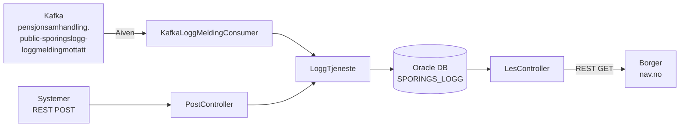

# sporingslogg

Tar imot sporingslogg-meldinger fra tjenester som har hatt innsyn i brukeres data, lagrer dem i databasen og gjør dem tilgjengelige for brukeren via nav.no.

## Arkitektur



## Dataflyt

1. Tjenester sender loggmeldinger enten via Kafka-topic eller direkte REST POST
2. Meldingen valideres (påkrevde felt, feltlengder, format på fnr/orgnr)
3. `leverteData` Base64-enkodes før lagring
4. Lagres i Oracle-tabell `SPORINGS_LOGG`
5. Borger kan hente egne logginnslag via `GET /api/les` etter innlogging med TokenX (ACR Level4)
6. Kun innslag med `samtykkeToken` leveres ut til nav.no

## REST API

| Endepunkt | Auth | Beskrivelse |
|-----------|------|-------------|
| `POST /sporingslogg/api/post` | Azure AD (EntraID) | System-til-system innsending av loggmelding |
| `GET /api/les` | TokenX (ACR Level4) | Borger henter egne sporingslogg-innslag |

## Kafka-topics

| Topic | Retning | Format |
|-------|---------|--------|
| `pensjonsamhandling.public-sporingslogg-loggmeldingmottatt` | Konsumerer | JSON |

## Loggmelding-format

```json
{
  "person": "12345678901",                            // Fnr/dnr for personen dataene gjelder
  "mottaker": "123456789",                            // Orgnr som dataene leveres ut til — skal være 9 sifre
  "tema": "ABC",                                      // Type data (3 tegn)
  "behandlingsGrunnlag": "hjemmelbeskrivelse",        // Hjemmel/samtykke for utlevering. Max 100 tegn
  "uthentingsTidspunkt": "2018-10-19T12:24:21.675",  // Tidspunkt for utlevering, ISO-format uten tidssone
  "leverteData": "<Base64-encodet JSON-melding>",     // Utleverte data. Max 1 000 000 tegn (hele meldingen må være under Kafkas grense på 1 MB)
  "samtykkeToken": "<JSON Web Token, encodet form>",  // Samtykketoken fra Altinn. Max 3995 tegn
  "dataForespoersel": "<forespørselen som er brukt>", // Request/dok for hvordan NAV hentet data. Max 100 000 tegn
  "leverandoer": "123456789"                          // Orgnr til den med utleveringsavtalen (ved delegering) — skal være 9 sifre
}
```

## ACK-oppførsel

Sporingslogg ACKer Kafka-meldinger selv om:

- Konvertering fra JSON feiler (ugyldig melding-format)
- Validering av påkrevde felt, feltlengder eller format feiler

Kun databasefeil vil føre til at meldingen ikke ACKes, slik at den retries.

## Tech stack

Kotlin · Spring Boot · Oracle DB · Kafka (Aiven) · Nais (FSS)

## Kontakt

Slack: [#pensjon_samhandling](https://nav-it.slack.com/archives/pensjon_samhandling)
