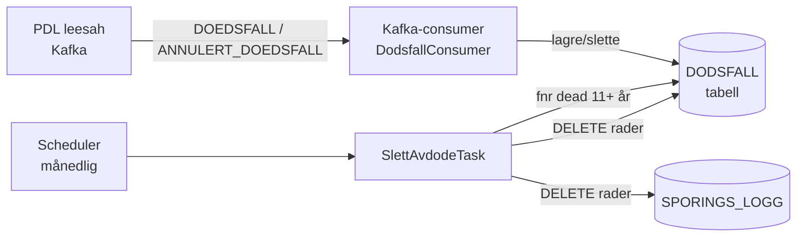

# Plan: Sletting av data for avdøde personer

## Bakgrunn

`sporingslogg` lagrer sporingsdata om NAVs datautleveringer — hvem som fikk tilgang til hvilke data om hvem. Juridisk team i NAV krever at alle data knyttet til en avdød person slettes 11 år etter dødsdato.

## Løsningsarkitektur

### Flyt

1. **Kafka-consumer** lytter på PDL-topic for `DOEDSFALL_V1`-hendelser
   - Ved dødsfall: lagre `(fnr, dødsdato)` i `DODSFALL`-tabellen
   - Ved `ANNULERT_DOEDSFALL`: slett raden fra `DODSFALL` → personen behandles som levende igjen
2. **Månedlig scheduled task** kjører og finner alle `DODSFALL`-rader der `dødsdato < i dag − 11 år`
   - Sletter alle rader i `SPORINGS_LOGG` for disse personene
   - Sletter alle rader i `DODSFALL` for disse personene

## Nye tabeller

### `DODSFALL`
| Kolonne | Type | Beskrivelse |
|---------|------|-------------|
| `FNR` | VARCHAR2(11) PK | Fødselsnummer/d-nummer |
| `DODSDATO` | DATE NOT NULL | Dødsdato fra PDL |
| `REGISTRERT` | TIMESTAMP NOT NULL | Tidspunkt hendelsen ble mottatt |

### `SLETTE_LOGG` *(vurderes)*
Logg over hva som er slettet. **OBS:** Må avklares med juridisk — hvis loggen inneholder fnr er den selv underlagt GDPR og trenger egen sletterutine. Alternativ: logg kun antall rader og tidspunkt, uten fnr.

| Kolonne | Type | Beskrivelse |
|---------|------|-------------|
| `ID` | NUMBER PK | Sekvens |
| `TIDSPUNKT` | TIMESTAMP | Når slettingen kjørte |
| `ANTALL_SLETTET` | NUMBER | Antall SPORINGS_LOGG-rader slettet |

## Åpne spørsmål

| # | Spørsmål | Eier |
|---|----------|------|
| 1 | Konsumere PDL direkte eller via `samordning-personoppslag` sin topic? | Arkitektur + juridisk |
| 2 | Trenger sporingslogg ny tilgangssøknad / mandat for PDL-topic? | Juridisk + Nais accessPolicy |
| 3 | Kreves slettelogg? Hva er krav til innhold og retention? | Juridisk |
| 4 | Hva er batch-størrelse og timeout-krav for månedlig slettejobb? | Team |

## Neste steg (når åpne spørsmål er avklart)

- [ ] Avklar PDL-tilgang og Kafka-topic-kilde
- [ ] Lag `V2__dodsfall.sql` Flyway-migrasjon
- [ ] Implementer `DodsfallConsumer` (Kafka)
- [ ] Implementer `SlettAvdodeTask` (`@Scheduled`)
- [ ] Avklar og evt. implementer `SLETTE_LOGG`
- [ ] Oppdater Nais-manifest med ny topic ACL
